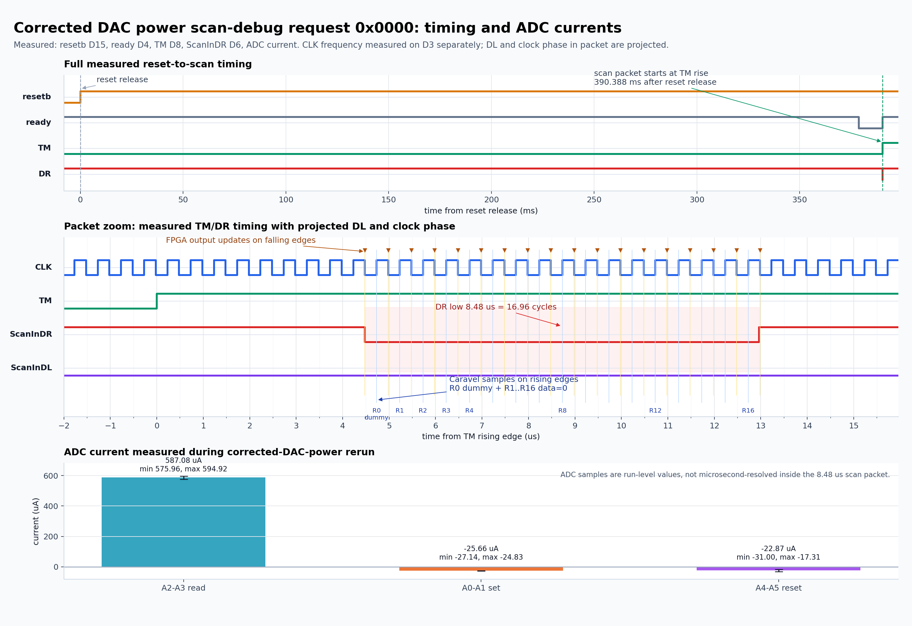

# FPGA Based Scan Debug

This README documents only the latest corrected-DAC-power timing diagram for scan-debug request `0x0000`.

The earlier ADC current readings should not be used, because DAC power VCC was applied incorrectly before this rerun.

## Latest Plot

## Signal Sources

| Lane | Source in plot |
| --- | --- |
| `TM` | Measured on Saleae `D8` in capture `scan_debug_req0000_2026-08-10/capture_122001_corrected_dac_power` |
| `DR` / `ScanInDR` | Measured on Saleae `D6` in capture `scan_debug_req0000_2026-08-10/capture_122001_corrected_dac_power` |
| `DL` | Projected low, because scan request `0x0000` sends dummy `0` plus sixteen `0` data bits |
| `CLK` | Measured on Saleae `D3` in post-correction clock check `scan_debug_req0000_2026-08-10/capture_122255_corrected_dac_d3_health` |
| ADC currents | Measured by ADC Teensy in `scan_debug_req0000_2026-08-10/capture_122001_corrected_dac_power/adc_monitor.csv` |

## Measured Timing

Times are relative to reset release on `D15`.

| Event | Time |
| --- | ---: |
| Reset release | `0.00000000 s` |
| Ready falls | `0.37884864 s` |
| Ready rises | `0.39032320 s` |
| `TM` rises | `0.39038848 s` |
| `DR` falls | `0.39039296 s` |
| `DR` rises | `0.39040144 s` |

Derived timing:

| Measurement | Value |
| --- | ---: |
| Ready high to `TM` high | `65.28 us` |
| `TM` high to `DR` low | `4.48 us` |
| `DR` low width | `8.48 us` |
| Measured clock period | `0.500 us` |
| Measured clock frequency | `2.000 MHz` |
| `DR` low width in clock cycles | `16.96 cycles` |

The `DR` low width matches the expected 17 qualified clock cycles: one dummy/setup bit followed by 16 LSB-first data bits.

## Projected Scan Data

Request `0x0000` projects this `DL` sequence:

| Qualified rising edge | Meaning | Projected `DL` |
| --- | --- | ---: |
| `R0` | Dummy/setup bit | `0` |
| `R1` through `R16` | 16 scan data bits, LSB first | `0` |

The FPGA updates `TM`, `DR`, and `DL` on falling clock edges. Caravel samples them on rising clock edges.

## Connection Backup

FPGA to Caravel connections use the AX7020 J10 header.

| FPGA signal | AX7020 pin | J10 pin | Caravel / board signal |
| --- | --- | --- | --- |
| `wb_clk_i` | `U14` / `IO1_7P` | `J10-16` | Caravel clock into FPGA |
| `caravel_resetb_i` | `W19` / `IO1_1N` | `J10-1` | Caravel `resetb` into FPGA |
| `caravel_ready_i` | `W18` / `IO1_1P` | `J10-4` | Caravel GPIO1 ready into FPGA |
| `caravel_tm_o` | `R14` / `IO1_2N` | `J10-3` | Scan-debug `TM` to Caravel |
| `caravel_scan_se_o` | `P14` / `IO1_2P` | `J10-6` | `ScanInDR` / active-low scan enable to Caravel GPIO21 |
| `caravel_scan_si_o` | `Y17` / `IO1_3N` | `J10-5` | `ScanInDL` scan data to Caravel |
| `caravel_scan_cc_o` | `Y16` / `IO1_3P` | `J10-8` | `ScanInCC` to Caravel |

Caravel board pad backup:

| Caravel pad / pin | Direction for this experiment | Connected signal |
| --- | --- | --- |
| Clock pin / `wb_clk_i` | Input to Caravel and FPGA clock reference | External Caravel clock, also probed by Saleae `D3` |
| `resetb` pin | Input to Caravel, input to FPGA reset monitor | Manual reset, also probed by Saleae `D15` |
| GPIO1 | Management output from Caravel | Ready signal to FPGA `caravel_ready_i`, also probed by Saleae `D4` |
| GPIO21 | User input to Caravel | `ScanInDR` / active-low `i_scan_se1`, driven by FPGA `caravel_scan_se_o`, also probed by Saleae `D6` |
| GPIO22 | User input to Caravel | `ScanInDL` / `i_scan_si1`, driven by FPGA `caravel_scan_si_o` |
| GPIO35 | User input to Caravel | `ScanInCC`, driven low by FPGA unless RTL uses it |
| GPIO36 | User input to Caravel | `TM` / `i_TM`, driven by FPGA `caravel_tm_o`, also probed by Saleae `D8` |

Caravel analog pad backup from the scan-debug firmware:

| Caravel GPIO | Analog signal |
| --- | --- |
| GPIO25 | `dc_bias = 1.0 V` |
| GPIO26 | `Vcc_wl_read` |
| GPIO27 | `Vcc_set` |
| GPIO28 | `Vcc_wl_reset` |
| GPIO29 | `Vbias = 1.6 V` |
| GPIO30 | `Vcc_wl_set` |
| GPIO31 | `Bias_comp2 = 0.6 V` |
| GPIO32 | `Vcomp = 0.9 V` |
| GPIO33 | `Vcc_read` |
| GPIO34 | `Iref = 0.5 V` |

Caravel firmware configuration backup:

| Item | Setting |
| --- | --- |
| Firmware file | `Firmware_read_form_set_reset/Firmware_scan_debug/scan_debug_read_mode/external_scan_setup.c` |
| Scan pins | Configured as `GPIO_MODE_USER_STD_INPUT_NOPULL`; firmware does not drive `TM`, `ScanInDR`, `ScanInDL`, or `ScanInCC` |
| Ready pin | GPIO1 is configured as management output and driven high after pad configuration |
| UART pins | GPIO5 = UART RX, GPIO6 = UART TX |

Saleae logic analyzer probe backup:

| Saleae channel | Signal |
| --- | --- |
| `D3` | Caravel clock / FPGA `wb_clk_i` |
| `D4` | Caravel GPIO1 ready |
| `D6` | `ScanInDR` / Caravel GPIO21 |
| `D8` | `TM` |
| `D15` | Caravel `resetb` |

ADC/DAC connection and rail backup:

| Item | Connection / value |
| --- | --- |
| ADC/DAC Teensy | `/dev/serial/by-id/usb-Teensyduino_USB_Serial_8829000-if00` |
| Si5351 clock Teensy | `/dev/serial/by-id/usb-Teensyduino_USB_Serial_10278510-if00` |
| ADC `A2-A3` | Read-current shunt channel used in latest corrected-DAC plot |
| ADC `A0-A1` | Set-current shunt channel |
| ADC `A4-A5` | Reset-current shunt channel |
| `Vcc_read` | `0.0 V` |
| `Vcc_set` | `1.7 V` |
| `Vcc_reset` | `0.0 V` |
| `Vcc_wl_read` | `0.0 V` |
| `Vcc_wl_set` | `2.5 V` |
| `Vcc_wl_reset` | `0.0 V` |

## Remote Access Backup

| System | Access |
| --- | --- |
| FPGA Windows PC | `ssh geethika@100.116.216.70` |
| FPGA Windows PC password | `Klok` |
| FPGA Vivado path | `C:\Xilinx\Vivado\2019.1\bin\vivado.bat` |
| FPGA project path | `C:\Users\geethika\zynq_scan_debug` |
| Remote Ubuntu controlling Caravel / Saleae / Teensy | `ssh ubuntu-24-04@100.98.132.51` |
| Remote Ubuntu Saleae API path | `/home/ubuntu-24-04/saleae-api` |
| Remote Ubuntu Caravel utilities path | `/home/ubuntu-24-04/caravel_board/firmware/chipignite/util` |
| Sudo password, when needed | `Naveen@2001` |
| ADC/DAC Teensy on remote Ubuntu | `/dev/serial/by-id/usb-Teensyduino_USB_Serial_8829000-if00` |
| Si5351 clock Teensy on remote Ubuntu | `/dev/serial/by-id/usb-Teensyduino_USB_Serial_10278510-if00` |

## Corrected ADC Current Measurements

These currents are measured during the corrected-DAC-power rerun. ADC samples are run-level measurements and are not microsecond-resolved inside the `8.48 us` scan packet.

| ADC pair | Mean current | Min | Max | Samples |
| --- | ---: | ---: | ---: | ---: |
| `A2-A3` read | `587.08 uA` | `575.96 uA` | `594.92 uA` | `12` |
| `A0-A1` set | `-25.66 uA` | `-27.14 uA` | `-24.83 uA` | `12` |
| `A4-A5` reset | `-22.87 uA` | `-31.00 uA` | `-17.31 uA` | `12` |

## Files

- Latest plot PNG: `scan_debug_req0000_2026-08-10/scan_debug_0x0000_corrected_dac_power_tm_dr_clk_current.png`
- Latest plot SVG: `scan_debug_req0000_2026-08-10/scan_debug_0x0000_corrected_dac_power_tm_dr_clk_current.svg`
- Summary data: `scan_debug_req0000_2026-08-10/scan_debug_0x0000_corrected_dac_power_tm_dr_clk_current_summary.json`
- Timing capture: `scan_debug_req0000_2026-08-10/capture_122001_corrected_dac_power/analysis.json`
- ADC data: `scan_debug_req0000_2026-08-10/capture_122001_corrected_dac_power/adc_monitor.csv`
- Clock check: `scan_debug_req0000_2026-08-10/capture_122255_corrected_dac_d3_health/analysis.json`
