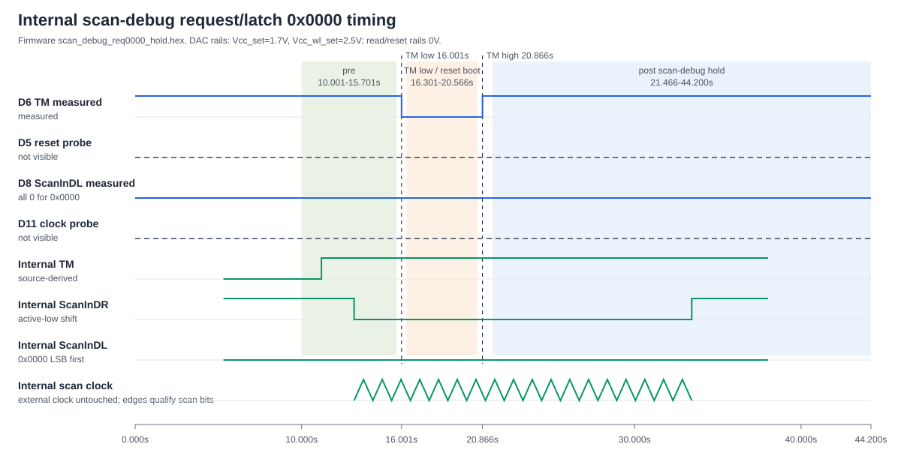
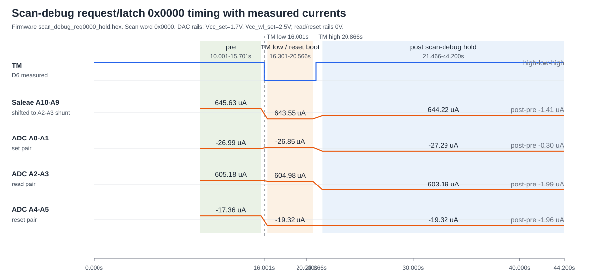
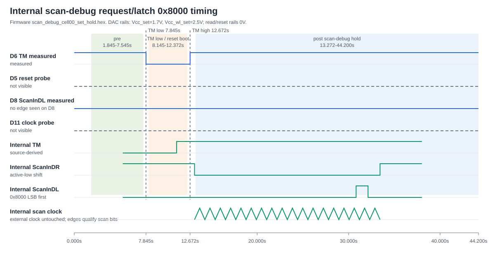
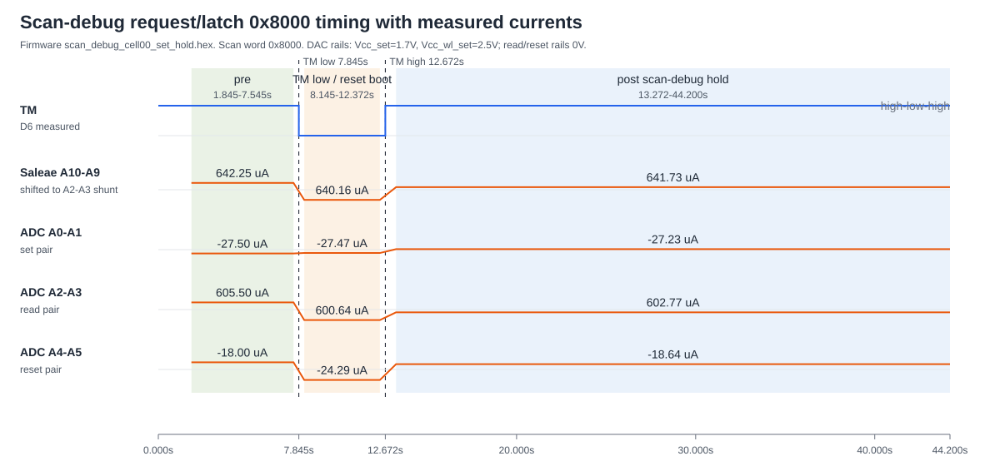
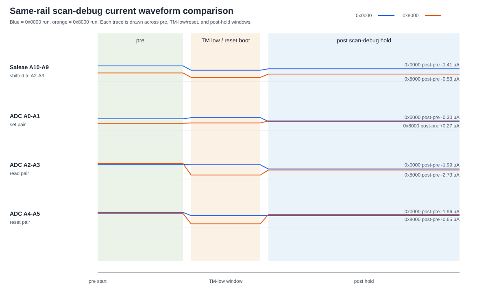
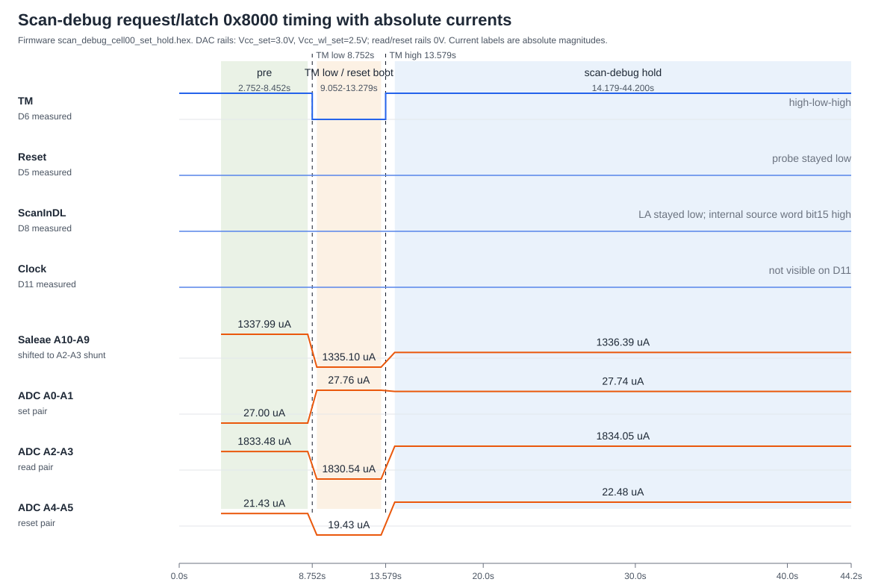
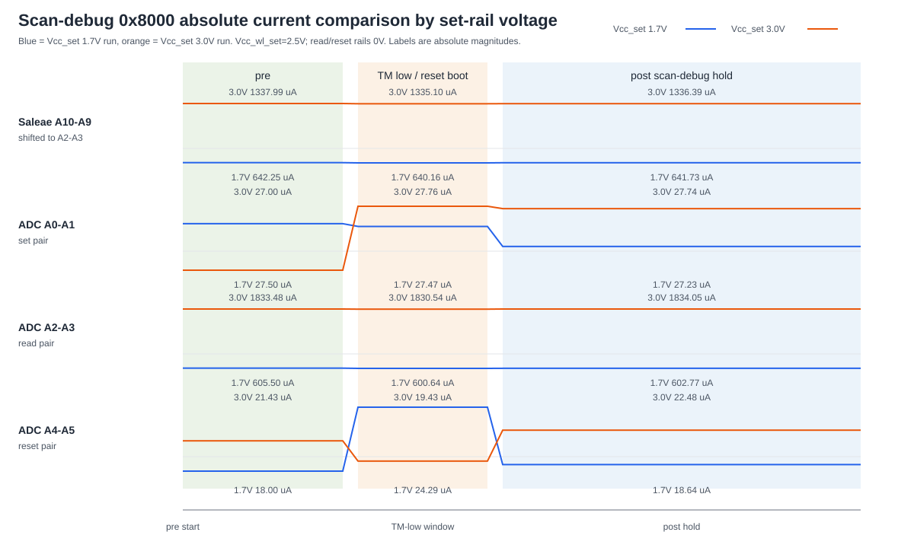
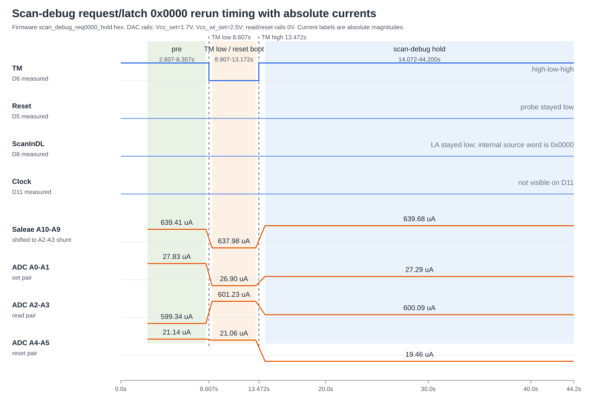
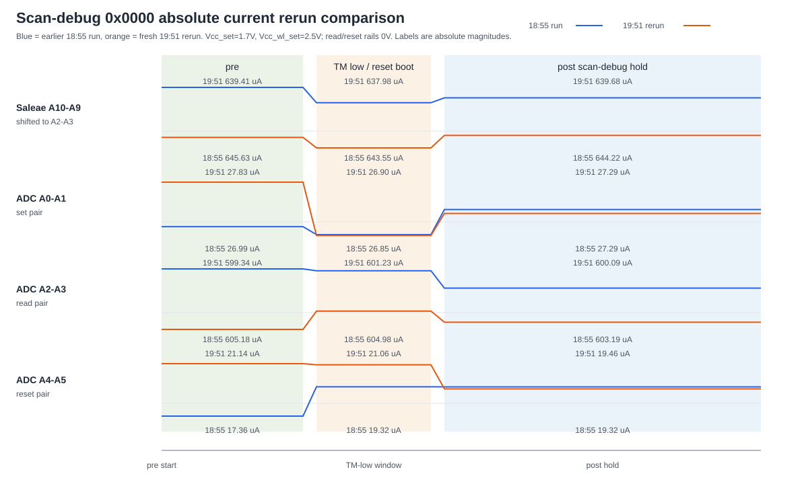

# Scan-debug request 0x0000 hardware run

Date: 2026-08-09

## Scope

This note documents the latest internal management scan-debug hardware run. The
Caravel management firmware drives scan debug internally. The external clock
Teensy was not modified. The ADC/DAC Teensy was used only for DAC rail setup and
ADS1258 current sampling.

Requested scan-debug word:

```text
request 0x0000 -> latch 0x0000
```

The generated Caravel image was:

```text
/home/ubuntu-24-04/caravel_board/firmware/chipignite/scan_debug/scan_debug_req0000_hold.hex
```

The flash/verify completed successfully through the FTDI/caravel housekeeping
path. Caravel reported:

```text
mfg        = 0456
product    = 11
project ID = 222b88a4
project ID = 2511d444
JEDEC      = ef4016
verified   = yes
```

## DAC rail setup

The DAC rails were explicitly set before the scan-debug capture:

| Rail | Voltage |
|---|---:|
| `Vcc_read` | 0 V |
| `Vcc_set` | 1.7 V |
| `Vcc_reset` | 0 V |
| `Vcc_wl_read` | 0 V |
| `Vcc_wl_set` | 2.5 V |
| `Vcc_wl_reset` | 0 V |

ADC/DAC Teensy confirmation:

```text
SCAN_SET_RAILS_DONE vcc_read_mV=0 vcc_set_mV=1700 vcc_reset_mV=0 vcc_wl_read_mV=0 vcc_wl_set_mV=2500 vcc_wl_reset_mV=0
ADS1258_STATUS ... check=PASS
```

## Capture artifact

Raw Saleae capture:

```text
/home/ubuntu-24-04/saleae-api/captures/internal-set00-hold-adc-la-reset-20260809-185524/internal_set00_hold_adc_la.sal
```

Important caveat: the capture script metadata still says
`firmware_expected=scan_debug_cell00_set_hold.hex` and
`scan_word_expected=0x8000`. That metadata is stale for this run. The flashed
Caravel image for this capture was `scan_debug_req0000_hold.hex`, built with
`SCAN_FW_OP_SET=0`, so the scan word is `0x0000`.

## Logic-analyzer timing

| Signal | Channel | Observation |
|---|---:|---|
| Reset probe | D5 | Stayed low in this LA capture |
| TM | D6 | High -> low -> high transition observed |
| ScanInDL | D8 | Stayed low, consistent with `0x0000` data |
| Clock probe | D11 | Not visible on this LA channel |
| Saleae analog shunt | A10-A9 | User shifted probe to ADC `A2-A3` shunt |

Measured TM edges:

| Event | Time |
|---|---:|
| TM falling edge | 16.001008960 s |
| TM rising edge | 20.866321920 s |

Analysis windows:

| Window | Start | End |
|---|---:|---:|
| Pre reset | 10.001009 s | 15.701009 s |
| TM-low after reset | 16.301009 s | 20.566322 s |
| Post scan-debug hold | 21.466322 s | 44.200000 s |



## Current measurements

All currents are reported in microamps. For the shunts, `1 mV` differential is
treated as `1 uA`.

The plots show absolute current magnitude. The tables retain signed measured
values for polarity/reference tracking.



| Measurement path | Window | Samples | Mean | Std dev | Min | Max | Span |
|---|---:|---:|---:|---:|---:|---:|---:|
| Saleae A10-A9, shifted to A2-A3 | Pre | 178125 | 645.629608 | 324.739546 | 157.000000 | 1165.000000 | 1008.000000 |
| Saleae A10-A9, shifted to A2-A3 | TM-low | 133291 | 643.551253 | 323.429551 | 152.000000 | 1165.000000 | 1013.000000 |
| Saleae A10-A9, shifted to A2-A3 | Post | 710427 | 644.221267 | 323.597559 | 152.000000 | 1166.000000 | 1014.000000 |
| ADC A2-A3 read | Pre | 10 | 605.175769 | 4.483661 | 598.706848 | 613.039185 | 14.332337 |
| ADC A2-A3 read | TM-low | 7 | 604.980259 | 3.178054 | 598.493347 | 609.504089 | 11.010742 |
| ADC A2-A3 read | Post | 38 | 603.189660 | 9.722928 | 586.651794 | 633.912170 | 47.260376 |
| ADC A0-A1 set | Pre | 10 | -26.987362 | 1.306290 | -29.465734 | -24.558641 | 4.907093 |
| ADC A0-A1 set | TM-low | 7 | -26.849642 | 1.217358 | -28.901377 | -24.858196 | 4.043181 |
| ADC A0-A1 set | Post | 38 | -27.286266 | 1.040147 | -29.808321 | -24.787033 | 5.021288 |
| ADC A4-A5 reset | Pre | 10 | -17.358535 | 3.909290 | -25.920710 | -11.806816 | 14.113894 |
| ADC A4-A5 reset | TM-low | 7 | -19.322673 | 7.364137 | -31.901905 | -10.126985 | 21.774920 |
| ADC A4-A5 reset | Post | 38 | -19.316321 | 3.914749 | -27.718048 | -11.063718 | 16.654330 |

Mean current deltas:

| Measurement path | TM-low minus pre | Post minus pre |
|---|---:|---:|
| Saleae A10-A9, shifted to A2-A3 | -2.078355 uA | -1.408341 uA |
| ADC A2-A3 read | -0.195510 uA | -1.986109 uA |
| ADC A0-A1 set | +0.137720 uA | -0.298904 uA |
| ADC A4-A5 reset | -1.964138 uA | -1.957786 uA |

## Result

With request/latch `0x0000` and the set-path rails enabled, the measured
post-hold current deltas are small:

- Saleae A10-A9 on the shifted A2-A3 shunt changed by `-1.408 uA`.
- ADC A2-A3 changed by `-1.986 uA`.
- ADC A0-A1 changed by `-0.299 uA`.
- ADC A4-A5 changed by `-1.958 uA`.

This run does not show a clean single-channel current increase from scan debug.
The Saleae analog path has a large spread in this configuration, and the ADC
pair deltas are small compared with the observed sample-to-sample variation.

## Same-setup comparison: request 0x8000 -> latch 0x8000

This section documents the follow-up run requested with the same bench setup and
DAC rails, changing only the internal scan word back to `0x8000`.

Requested scan-debug word:

```text
request 0x8000 -> latch 0x8000
```

The generated/flashed Caravel image was the existing set-path image:

```text
/home/ubuntu-24-04/caravel_board/firmware/chipignite/scan_debug/scan_debug_cell00_set_hold.hex
```

Flash/verify completed successfully through the FTDI/caravel housekeeping path.
Caravel reported:

```text
mfg        = 0456
product    = 11
project ID = 222b88a4
project ID = 2511d444
JEDEC      = ef4016
verified   = yes
```

The DAC rails were re-confirmed before capture and were unchanged from the
`0x0000` run:

| Rail | Voltage |
|---|---:|
| `Vcc_read` | 0 V |
| `Vcc_set` | 1.7 V |
| `Vcc_reset` | 0 V |
| `Vcc_wl_read` | 0 V |
| `Vcc_wl_set` | 2.5 V |
| `Vcc_wl_reset` | 0 V |

ADC/DAC Teensy confirmation:

```text
SCAN_SET_RAILS_DONE vcc_read_mV=0 vcc_set_mV=1700 vcc_reset_mV=0 vcc_wl_read_mV=0 vcc_wl_set_mV=2500 vcc_wl_reset_mV=0
ADS1258_STATUS ... check=PASS
```

Raw Saleae capture:

```text
/home/ubuntu-24-04/saleae-api/captures/internal-set00-hold-adc-la-reset-20260809-190453/internal_set00_hold_adc_la.sal
```

Logic-analyzer timing:

| Signal | Channel | Observation |
|---|---:|---|
| Reset probe | D5 | Stayed low in this LA capture |
| TM | D6 | High -> low -> high transition observed |
| ScanInDL | D8 | Stayed low on the LA channel; source-derived internal scan word has bit15 high for `0x8000` |
| Clock probe | D11 | Not visible on this LA channel |
| Saleae analog shunt | A10-A9 | User-shifted probe to ADC `A2-A3` shunt |

Measured TM edges:

| Event | Time |
|---|---:|
| TM falling edge | 7.845294080 s |
| TM rising edge | 12.671893920 s |

Analysis windows:

| Window | Start | End |
|---|---:|---:|
| Pre reset | 1.845294 s | 7.545294 s |
| TM-low after reset | 8.145294 s | 12.371894 s |
| Post scan-debug hold | 13.271894 s | 44.200000 s |



Current measurements:

The plots show absolute current magnitude. The tables retain signed measured
values for polarity/reference tracking.



| Measurement path | Window | Samples | Mean | Std dev | Min | Max | Span |
|---|---:|---:|---:|---:|---:|---:|---:|
| Saleae A10-A9, shifted to A2-A3 | Pre | 178125 | 642.252575 | 323.232873 | 157.000000 | 1165.000000 | 1008.000000 |
| Saleae A10-A9, shifted to A2-A3 | TM-low | 132081 | 640.157865 | 322.467130 | 152.000000 | 1160.000000 | 1008.000000 |
| Saleae A10-A9, shifted to A2-A3 | Post | 966503 | 641.727120 | 322.819571 | 153.000000 | 1160.000000 | 1007.000000 |
| ADC A2-A3 read | Pre | 9 | 605.501397 | 9.376830 | 590.822388 | 620.521484 | 29.699096 |
| ADC A2-A3 read | TM-low | 7 | 600.636597 | 11.219710 | 589.799622 | 620.291443 | 30.491821 |
| ADC A2-A3 read | Post | 51 | 602.773178 | 6.953332 | 588.675842 | 622.941101 | 34.265259 |
| ADC A0-A1 set | Pre | 9 | -27.501427 | 1.087070 | -28.858349 | -25.531786 | 3.326563 |
| ADC A0-A1 set | TM-low | 7 | -27.468615 | 0.802477 | -28.687881 | -26.279848 | 2.408033 |
| ADC A0-A1 set | Post | 51 | -27.231314 | 1.058960 | -29.901003 | -24.232603 | 5.668400 |
| ADC A4-A5 reset | Pre | 9 | -17.997644 | 5.071623 | -28.883173 | -12.402618 | 16.480555 |
| ADC A4-A5 reset | TM-low | 7 | -24.294313 | 5.677002 | -34.323177 | -15.298880 | 19.024297 |
| ADC A4-A5 reset | Post | 51 | -18.643583 | 4.443273 | -29.488905 | -10.759197 | 18.729708 |

Mean current deltas:

| Measurement path | TM-low minus pre | Post minus pre |
|---|---:|---:|
| Saleae A10-A9, shifted to A2-A3 | -2.094710 uA | -0.525455 uA |
| ADC A2-A3 read | -4.864800 uA | -2.728219 uA |
| ADC A0-A1 set | +0.032812 uA | +0.270113 uA |
| ADC A4-A5 reset | -6.296669 uA | -0.645939 uA |

### 0x0000 vs 0x8000 summary

Both runs used the same set-path DAC rails and the Saleae analog probe shifted
to the ADC `A2-A3` shunt. Neither run shows a clean single-channel current
increase from internal scan debug.



| Scan word | Saleae A10-A9 post-pre | ADC A2-A3 post-pre | ADC A0-A1 post-pre | ADC A4-A5 post-pre |
|---|---:|---:|---:|---:|
| `0x0000` | -1.408 uA | -1.986 uA | -0.299 uA | -1.958 uA |
| `0x8000` | -0.525 uA | -2.728 uA | +0.270 uA | -0.646 uA |

## Set-rail rerun: request 0x8000 -> latch 0x8000, Vcc_set 3.0 V

This run repeated the `0x8000` internal scan-debug request with only the set
rail changed to `3.0 V`.

DAC rails:

| Rail | Voltage |
|---|---:|
| `Vcc_read` | 0 V |
| `Vcc_set` | 3.0 V |
| `Vcc_reset` | 0 V |
| `Vcc_wl_read` | 0 V |
| `Vcc_wl_set` | 2.5 V |
| `Vcc_wl_reset` | 0 V |

ADC/DAC Teensy confirmation:

```text
SCAN_SET3V_RAILS_DONE vcc_read_mV=0 vcc_set_mV=3000 vcc_reset_mV=0 vcc_wl_read_mV=0 vcc_wl_set_mV=2500 vcc_wl_reset_mV=0
ADS1258_STATUS ... check=PASS
```

Raw Saleae capture:

```text
/home/ubuntu-24-04/saleae-api/captures/internal-set00-hold-adc-la-reset-20260809-194340/internal_set00_hold_adc_la.sal
```

Measured TM edges:

| Event | Time |
|---|---:|
| TM falling edge | 8.751956640 s |
| TM rising edge | 13.578558240 s |

Analysis windows:

| Window | Start | End |
|---|---:|---:|
| Pre reset | 2.751957 s | 8.451957 s |
| TM-low after reset | 9.051957 s | 13.278558 s |
| Post scan-debug hold | 14.178558 s | 44.200000 s |

Current plots:





Current measurements:

The plots show absolute current magnitude. The tables retain signed measured
values for polarity/reference tracking.

| Measurement path | Window | Samples | Mean | Std dev | Min | Max | Span |
|---|---:|---:|---:|---:|---:|---:|---:|
| Saleae A10-A9, shifted to A2-A3 | Pre | 178125 | 1337.987138 | 502.862032 | 587.000000 | 2138.000000 | 1551.000000 |
| Saleae A10-A9, shifted to A2-A3 | TM-low | 132081 | 1335.101854 | 501.135835 | 587.000000 | 2133.000000 | 1546.000000 |
| Saleae A10-A9, shifted to A2-A3 | Post | 938170 | 1336.391470 | 501.581456 | 587.000000 | 2133.000000 | 1546.000000 |
| ADC A2-A3 read | Pre | 10 | 1833.479370 | 7.790007 | 1819.712646 | 1847.013672 | 27.301026 |
| ADC A2-A3 read | TM-low | 7 | 1830.537859 | 5.770647 | 1817.927002 | 1836.318970 | 18.391968 |
| ADC A2-A3 read | Post | 50 | 1834.045403 | 8.456275 | 1820.862915 | 1855.745483 | 34.882568 |
| ADC A0-A1 set | Pre | 10 | -27.002755 | 1.017574 | -28.669678 | -25.283535 | 3.386143 |
| ADC A0-A1 set | TM-low | 7 | -27.763206 | 0.476124 | -28.393290 | -27.026257 | 1.367033 |
| ADC A0-A1 set | Post | 50 | -27.735392 | 1.131507 | -30.041676 | -25.056797 | 4.984879 |
| ADC A4-A5 reset | Pre | 10 | -21.428196 | 4.530825 | -29.800047 | -15.346875 | 14.453172 |
| ADC A4-A5 reset | TM-low | 7 | -19.433322 | 8.752979 | -33.709171 | -5.064320 | 28.644851 |
| ADC A4-A5 reset | Post | 50 | -22.481873 | 6.088898 | -35.350937 | -13.523058 | 21.827879 |

Mean current deltas:

| Measurement path | TM-low minus pre | Post minus pre |
|---|---:|---:|
| Saleae A10-A9, shifted to A2-A3 | -2.885284 uA | -1.595668 uA |
| ADC A2-A3 read | -2.941511 uA | +0.566033 uA |
| ADC A0-A1 set | -0.760451 uA | -0.732637 uA |
| ADC A4-A5 reset | +1.994874 uA | -1.053677 uA |

### 0x8000 set-rail comparison

Raising `Vcc_set` from `1.7 V` to `3.0 V` increased the absolute A2-A3/read
current baseline from about `603 uA` to about `1834 uA` across the whole
capture. The scan-debug hold change remained small: ADC A2-A3 post minus pre
was `+0.566 uA`, and Saleae A10-A9 post minus pre was `-1.596 uA`.

## Fresh rerun: request 0x0000 -> latch 0x0000

This run reflashed Caravel with the `0x0000` scan-debug image, reset Caravel
during capture, and used the requested set-path DAC rails.

The flashed Caravel image was:

```text
/home/ubuntu-24-04/caravel_board/firmware/chipignite/scan_debug/scan_debug_req0000_hold.hex
```

Flash/verify completed successfully through the FTDI/caravel housekeeping path.
Caravel reported:

```text
mfg        = 0456
product    = 11
project ID = 222b88a4
project ID = 2511d444
JEDEC      = ef4016
verified   = yes
```

DAC rails:

| Rail | Voltage |
|---|---:|
| `Vcc_read` | 0 V |
| `Vcc_set` | 1.7 V |
| `Vcc_reset` | 0 V |
| `Vcc_wl_read` | 0 V |
| `Vcc_wl_set` | 2.5 V |
| `Vcc_wl_reset` | 0 V |

ADC/DAC Teensy confirmation:

```text
SCAN_SET_RAILS_DONE vcc_read_mV=0 vcc_set_mV=1700 vcc_reset_mV=0 vcc_wl_read_mV=0 vcc_wl_set_mV=2500 vcc_wl_reset_mV=0
ADS1258_STATUS label=CMD id=0x8B check=PASS
```

Raw Saleae capture:

```text
/home/ubuntu-24-04/saleae-api/captures/internal-set00-hold-adc-la-reset-20260809-195146/internal_set00_hold_adc_la.sal
```

Important caveat: the capture script metadata still reports
`firmware_expected=scan_debug_cell00_set_hold.hex` and
`scan_word_expected=0x8000`. That metadata is stale for this rerun. The flashed
Caravel image was `scan_debug_req0000_hold.hex`, so this run is
`request 0x0000 -> latch 0x0000`.

Measured TM edges:

| Event | Time |
|---|---:|
| TM falling edge | 8.606506880 s |
| TM rising edge | 13.471821920 s |

Analysis windows:

| Window | Start | End |
|---|---:|---:|
| Pre reset | 2.606507 s | 8.306507 s |
| TM-low after reset | 8.906507 s | 13.171822 s |
| Post scan-debug hold | 14.071822 s | 44.200000 s |

Current plots:





Current measurements:

The plots show absolute current magnitude. The tables retain signed measured
values for polarity/reference tracking.

| Measurement path | Window | Samples | Mean | Std dev | Min | Max | Span |
|---|---:|---:|---:|---:|---:|---:|---:|
| Saleae A10-A9, shifted to A2-A3 | Pre | 178125 | 639.405457 | 322.398442 | 152.000000 | 1160.000000 | 1008.000000 |
| Saleae A10-A9, shifted to A2-A3 | TM-low | 133292 | 637.982910 | 321.341643 | 152.000000 | 1155.000000 | 1003.000000 |
| Saleae A10-A9, shifted to A2-A3 | Post | 941505 | 639.678930 | 321.884237 | 152.000000 | 1160.000000 | 1008.000000 |
| ADC A2-A3 read | Pre | 9 | 599.338888 | 7.509891 | 586.468079 | 610.043640 | 23.575561 |
| ADC A2-A3 read | TM-low | 7 | 601.231210 | 9.077819 | 587.518982 | 615.248657 | 27.729675 |
| ADC A2-A3 read | Post | 50 | 600.085444 | 6.155785 | 588.311768 | 617.684814 | 29.373046 |
| ADC A0-A1 set | Pre | 9 | -27.832611 | 0.717233 | -28.626646 | -26.203716 | 2.422930 |
| ADC A0-A1 set | TM-low | 7 | -26.904967 | 1.286748 | -28.012640 | -24.517265 | 3.495375 |
| ADC A0-A1 set | Post | 50 | -27.288342 | 0.929091 | -29.430979 | -25.003838 | 4.427141 |
| ADC A4-A5 reset | Pre | 9 | -21.142339 | 6.222763 | -34.660801 | -15.686151 | 18.974650 |
| ADC A4-A5 reset | TM-low | 7 | -21.064213 | 8.479213 | -34.448959 | -12.743551 | 21.705408 |
| ADC A4-A5 reset | Post | 50 | -19.455329 | 6.573124 | -45.242908 | -9.709923 | 35.532985 |

Mean current deltas:

| Measurement path | TM-low minus pre | Post minus pre |
|---|---:|---:|
| Saleae A10-A9, shifted to A2-A3 | -1.422547 uA | +0.273473 uA |
| ADC A2-A3 read | +1.892322 uA | +0.746556 uA |
| ADC A0-A1 set | +0.927644 uA | +0.544269 uA |
| ADC A4-A5 reset | +0.078126 uA | +1.687010 uA |

### Fresh 0x0000 rerun result

The fresh `0x0000` rerun again does not show a clean single-channel scan-debug
current increase. Post-hold changes were small on all measured paths: Saleae
A10-A9 `+0.273 uA`, ADC A2-A3 `+0.747 uA`, ADC A0-A1 `+0.544 uA`, and ADC
A4-A5 `+1.687 uA`.
