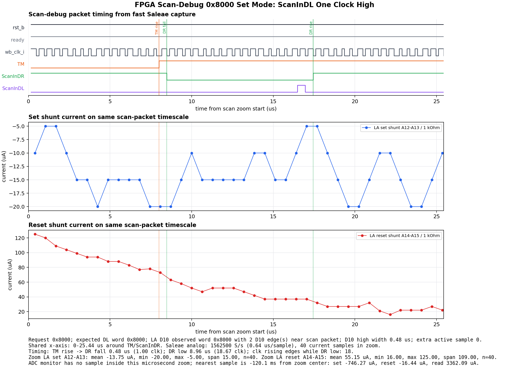
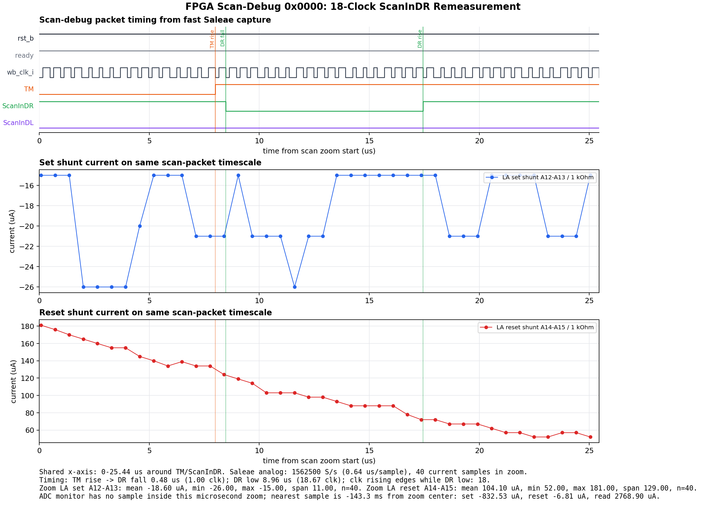

# Scan Debug Time Accurate Experiment

This README records the final FPGA time-accurate scan-debug experiment for set-mode packet `0x8000`.

## Result

The FPGA generated scan-debug packet `0x8000` with `ScanInDL` high for exactly one measured clock period.

`ScanInDL` rises after the 16th data-bit falling-edge update and falls again at the next falling-edge update, so the 18th active sample is low.

## Capture Setup

| Item | Value |
| --- | --- |
| Capture timestamp | `2026-08-11 11:28:17` |
| Request | `0x8000` set mode |
| FPGA update edge | Falling edge of `wb_clk_i` |
| Caravel sample edge | Rising edge of `wb_clk_i` |
| Saleae digital rate | `6.25 MS/s` |
| Saleae analog rate | `1.5625 MS/s` |
| Trigger | `D7/rst_b` rising, manual Caravel reset release |
| Shunt value | `1 kOhm` |
| Programmed bitstream SHA256 | `0D43CDC0BA325E06BDA3440710B133513DD6EC2FD6FDA45B88F0DFBF674B5E84` |

## Timing Results

Times are relative to reset release because Saleae triggered on `D7/rst_b` rising.

| Event / measurement | Value |
| --- | ---: |
| `D6/ready` fall | `0.37884864 s` |
| `D6/ready` rise | `0.39032320 s` |
| `D9/TM` rise | `0.39038848 s` |
| `D11/ScanInDR` fall | `0.39038896 s` |
| `D10/ScanInDL` rise | `0.39039696 s` |
| `D10/ScanInDL` fall | `0.39039744 s` |
| `D11/ScanInDR` rise | `0.39039792 s` |
| `ScanInDL` high width | `0.48 us` / `1.00 clk` |
| `ScanInDR` low width | `8.96 us` / `18.67 clk` |
| Active clock rising edges while `ScanInDR=0` | `18` |

## Decoded Scan Packet

| Item | Value |
| --- | --- |
| Dummy/setup bit | `0` |
| Data bits, LSB first | `0000000000000001` |
| Captured word | `0x8000` |
| 16th data bit | `1` |
| 18th active sample | `0` |

## Caravel GPIO State

From `Firmware_read_form_set_reset/Firmware_scan_debug/scan_debug_read_mode/external_scan_setup.c`.

| GPIO | Mode | Experiment role |
| --- | --- | --- |
| GPIO1 | `GPIO_MODE_MGMT_STD_OUTPUT` | Ready/heartbeat output to FPGA and LA `D6` |
| GPIO21 | `GPIO_MODE_USER_STD_INPUT_NOPULL` | `ScanInDR`, active-low scan enable, FPGA-driven, LA `D11` |
| GPIO22 | `GPIO_MODE_USER_STD_INPUT_NOPULL` | `ScanInDL`, scan serial data, FPGA-driven, LA `D10` |
| GPIO35 | `GPIO_MODE_USER_STD_INPUT_NOPULL` | `ScanInCC`, FPGA-driven low unless used |
| GPIO36 | `GPIO_MODE_USER_STD_INPUT_NOPULL` | `TM`, FPGA-driven, LA `D9` |
| GPIO25 | `GPIO_MODE_USER_STD_ANALOG` | `dc_bias` |
| GPIO26 | `GPIO_MODE_USER_STD_ANALOG` | `Vcc_wl_read` |
| GPIO27 | `GPIO_MODE_USER_STD_ANALOG` | `Vcc_set` |
| GPIO28 | `GPIO_MODE_USER_STD_ANALOG` | `Vcc_wl_reset` |
| GPIO29 | `GPIO_MODE_USER_STD_ANALOG` | `Vbias` |
| GPIO30 | `GPIO_MODE_USER_STD_ANALOG` | `Vcc_wl_set` |
| GPIO31 | `GPIO_MODE_USER_STD_ANALOG` | `Bias_comp2` |
| GPIO32 | `GPIO_MODE_USER_STD_ANALOG` | `Vcomp` |
| GPIO33 | `GPIO_MODE_USER_STD_ANALOG` | `Vcc_read` |
| GPIO34 | `GPIO_MODE_USER_STD_ANALOG` | `Iref` |

Firmware does not drive `ScanInDR`, `ScanInDL`, `ScanInCC`, or `TM`; those are external FPGA inputs to Caravel.

## DAC Voltages

The ADC/DAC Teensy rail command for this run returned:

`SCAN_SET_RAILS_DONE vcc_read_mV=0 vcc_set_mV=1700 vcc_reset_mV=0 vcc_wl_read_mV=0 vcc_wl_set_mV=2500 vcc_wl_reset_mV=0`

| Rail | Requested / returned voltage |
| --- | ---: |
| `Vcc_read` | `0.0 V` |
| `Vcc_set` | `1.7 V` |
| `Vcc_reset` | `0.0 V` |
| `Vcc_wl_read` | `0.0 V` |
| `Vcc_wl_set` | `2.5 V` |
| `Vcc_wl_reset` | `0.0 V` |

The fast Saleae capture used analog channels `A12-A15` for the shunt voltages, so it did not directly remeasure DAC rails `A0-A5` in this run.

## Current Results

Saleae current uses `I = (V+ - V-) / 1 kOhm`.

| Window | Channel pair | Mean | Min | Max | Span | Samples |
| --- | --- | ---: | ---: | ---: | ---: | ---: |
| Full capture | `A12-A13` set shunt | `-10.91 uA` | `-77.00 uA` | `15.00 uA` | `92.00 uA` | `1265625` |
| Full capture | `A14-A15` reset shunt | `91.13 uA` | `-21.00 uA` | `295.00 uA` | `316.00 uA` | `1265625` |
| `0-25.44 us` scan zoom | `A12-A13` set shunt | `-13.75 uA` | `-20.00 uA` | `-5.00 uA` | `15.00 uA` | `40` |
| `0-25.44 us` scan zoom | `A14-A15` reset shunt | `55.15 uA` | `16.00 uA` | `125.00 uA` | `109.00 uA` | `40` |

ADC monitor ran in parallel but did not produce a sample inside the microsecond scan zoom. ADC full-run summary from `42` samples: read `3313.33 uA` mean, set `-754.25 uA` mean, reset `-12.15 uA` mean.

## Files

| File | Path |
| --- | --- |
| README | `TEST_Bench/scan_debug_time_accurate_experiment.md` |
| Plot PNG | `TEST_Bench/scan_debug_time_accurate_experiment.png` |
| Plot SVG | `TEST_Bench/scan_debug_time_accurate_experiment.svg` |
| Raw capture summary | `TEST_Bench/scan_debug_req8000_2026-08-11/capture_112817_fpga_manual_reset_fast_saleae_j10_7_dl_oneclk/analysis.json` |
| Decoded scan bits | `TEST_Bench/scan_debug_req8000_2026-08-11/capture_112817_fpga_manual_reset_fast_saleae_j10_7_dl_oneclk/scan_bits.json` |
| FPGA RTL | `fpga_scan_debug_zynq7020_remote_sync/caravel_scan_debug_fpga.v` |
| FPGA constraints | `fpga_scan_debug_zynq7020_remote_sync/caravel_scan_debug_fpga.xdc` |

## Previous 18-Clock Reset Result

This is the previous FPGA time-accurate `0x0000` scan-debug run after extending `ScanInDR` low to 18 sampled `wb_clk_i` rising edges.

| Item | Value |
| --- | --- |
| Capture timestamp | `2026-08-11 10:21:16` |
| Request | `0x0000` |
| FPGA update edge | Falling edge of `wb_clk_i` |
| Caravel sample edge | Rising edge of `wb_clk_i` |
| Saleae digital rate | `6.25 MS/s` |
| Saleae analog rate | `1.5625 MS/s` |
| Trigger | `D7/rst_b` falling, manual Caravel reset |
| Shunt value | `1 kOhm` |
| Programmed bitstream SHA256 | `E9400F40705237466C715DB4EF066B692D96E308E7E42DB59B9DE0F2AACC0DD3` |
| Final FPGA hold state | `TM=1, ScanInDR=1, ScanInDL=0, ScanInCC=0` |

Timing was captured on LA `D6-D11`. Absolute times are Saleae trigger-relative.

| Event / measurement | Value |
| --- | ---: |
| `D7/rst_b` rise | `0.69900976 s` |
| `D6/ready` rise | `1.08933328 s` |
| `D9/TM` rise | `1.08939856 s` |
| `D11/ScanInDR` fall | `1.08939904 s` |
| `D11/ScanInDR` rise | `1.08940800 s` |
| `TM` rise to `ScanInDR` fall | `0.48 us` / `1.00 clk` |
| `ScanInDR` low width | `8.96 us` |
| Active `D8/wb_clk_i` rising edges while `ScanInDR=0` | `18` |

The capture script's width/period ratio reports `18.667` because the `6.25 MS/s` digital sample rate quantizes the near-scan clock period to `0.48 us`. The direct edge count is the correct check for the requested 18-clock interval.

### GPIO State For This Run

Caravel firmware used `Firmware_read_form_set_reset/Firmware_scan_debug/scan_debug_read_mode/external_scan_setup.c`. Firmware only configures the scan pins as inputs; the FPGA drives the time-critical scan-debug pins.

| GPIO | Mode | Run state / role |
| --- | --- | --- |
| GPIO1 | `GPIO_MODE_MGMT_STD_OUTPUT` | Ready output to FPGA and LA `D6` |
| GPIO21 | `GPIO_MODE_USER_STD_INPUT_NOPULL` | `ScanInDR`, FPGA-driven active-low scan enable, LA `D11` |
| GPIO22 | `GPIO_MODE_USER_STD_INPUT_NOPULL` | `ScanInDL`, FPGA-driven scan data, LA `D10`; low for request `0x0000` |
| GPIO35 | `GPIO_MODE_USER_STD_INPUT_NOPULL` | `ScanInCC`, FPGA-driven low |
| GPIO36 | `GPIO_MODE_USER_STD_INPUT_NOPULL` | `TM`, FPGA-driven, LA `D9`; final hold high |
| GPIO25 | `GPIO_MODE_USER_STD_ANALOG` | `dc_bias` |
| GPIO26 | `GPIO_MODE_USER_STD_ANALOG` | `Vcc_wl_read` |
| GPIO27 | `GPIO_MODE_USER_STD_ANALOG` | `Vcc_set` |
| GPIO28 | `GPIO_MODE_USER_STD_ANALOG` | `Vcc_wl_reset` |
| GPIO29 | `GPIO_MODE_USER_STD_ANALOG` | `Vbias` |
| GPIO30 | `GPIO_MODE_USER_STD_ANALOG` | `Vcc_wl_set` |
| GPIO31 | `GPIO_MODE_USER_STD_ANALOG` | `Bias_comp2` |
| GPIO32 | `GPIO_MODE_USER_STD_ANALOG` | `Vcomp` |
| GPIO33 | `GPIO_MODE_USER_STD_ANALOG` | `Vcc_read` |
| GPIO34 | `GPIO_MODE_USER_STD_ANALOG` | `Iref` |

### DAC Voltages For This Run

ADC/DAC Teensy returned:

`SCAN_SET_RAILS_DONE vcc_read_mV=0 vcc_set_mV=1700 vcc_reset_mV=0 vcc_wl_read_mV=0 vcc_wl_set_mV=2500 vcc_wl_reset_mV=0`

| Rail | Requested / returned voltage |
| --- | ---: |
| `Vcc_read` | `0.0 V` |
| `Vcc_set` | `1.7 V` |
| `Vcc_reset` | `0.0 V` |
| `Vcc_wl_read` | `0.0 V` |
| `Vcc_wl_set` | `2.5 V` |
| `Vcc_wl_reset` | `0.0 V` |

Saleae analog channels were assigned to shunt probes `A12-A15` for this run, so DAC rails `A0-A5` were set and reported by the DAC Teensy command but were not directly remeasured by Saleae in the same capture.

### Reset And Shunt Current Results

Saleae current uses `I = (V+ - V-) / 1 kOhm`.

| Window | Channel pair | Mean | Min | Max | Span | Samples |
| --- | --- | ---: | ---: | ---: | ---: | ---: |
| Full capture | `A12-A13` set shunt | `-10.34 uA` | `-77.00 uA` | `16.00 uA` | `93.00 uA` | `1968750` |
| Full capture | `A14-A15` reset shunt | `110.35 uA` | `-31.00 uA` | `331.00 uA` | `362.00 uA` | `1968750` |
| `0-25.44 us` scan zoom | `A12-A13` set shunt | `-18.60 uA` | `-26.00 uA` | `-15.00 uA` | `11.00 uA` | `40` |
| `0-25.44 us` scan zoom | `A14-A15` reset shunt | `104.10 uA` | `52.00 uA` | `181.00 uA` | `129.00 uA` | `40` |

ADC monitor ran in parallel but did not produce a sample inside the microsecond scan zoom. ADC full-run summary from `37` samples: read `2637.56 uA` mean, set `-836.93 uA` mean, reset `-13.73 uA` mean.

Files for this previous result:

| File | Path |
| --- | --- |
| Plot PNG | `TEST_Bench/scan_debug_time_accurate_experiment_18clk_previous.png` |
| Plot SVG | `TEST_Bench/scan_debug_time_accurate_experiment_18clk_previous.svg` |
| Raw capture summary | `TEST_Bench/scan_debug_req0000_2026-08-11/capture_102116_fpga_manual_reset_fast_saleae_18clk/analysis.json` |
| Raw analog current export | `TEST_Bench/scan_debug_req0000_2026-08-11/capture_102116_fpga_manual_reset_fast_saleae_18clk/analog.csv` |
| ADC monitor export | `TEST_Bench/scan_debug_req0000_2026-08-11/capture_102116_fpga_manual_reset_fast_saleae_18clk/adc_monitor.csv` |
